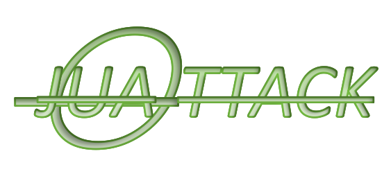

# java_unserial_attackcode

反序列化字节码生成工具，maven直接加载，无需额外配置生成反序列化payload

<!-- PROJECT SHIELDS -->

[![Contributors][contributors-shield]][contributors-url]
[![Forks][forks-shield]][forks-url]
[![Stargazers][stars-shield]][stars-url]
[![Issues][issues-shield]][issues-url]
[![MIT License][license-shield]][license-url]
[![LinkedIn][linkedin-shield]][linkedin-url]

<!-- PROJECT LOGO -->
 

  

  <h3 align="center">JAVA 反序列化payload生成工具</h3>

 本篇README.md面向开发者
 
## 目录

- [上手指南](#上手指南)
  - [开发前的配置要求](#开发前的配置要求)
  - [安装步骤](#安装步骤)
- [目前包含的框架](#使用到的框架)
- [目录介绍](#目录介绍)
- [贡献者](#贡献者)
  - [如何参与开源项目](#如何参与开源项目)
- [版本控制](#版本控制)
- [作者](#作者)
- [鸣谢](#鸣谢)

### 上手指南

需要哪个payload就进去运行哪个。生成的字节码在项目文件ser.bin，可自行送往base64编码

项目运行需要排除ctf_complates_exclude，othercase目录

试运行，请修改至漏洞sdk，如CC1 JDK<=8U65

java目录下为三个恶意类加载源文件，分别是：

* JNDI开HTTP所需恶意类，JNDI_RuntimeEvil
* TemplatesImpl恶意类反弹shell，TemplatesImpl_bash_shell
* TemplatesImpl弹计算器（本地测试使用），TemplatesImpl_RuntimeEvil

类加载时自行更改文件路径

其他漏洞分析需要的文件：

* AnnotationInvocationHandler调试，JDK8u65 sun包：https://hg.openjdk.org/jdk8u/jdk8u/jdk/archive/af660750b2f4.zip
* Tomcat 8.5.56源码，Shiro分析Tomcat自定义双亲委派，请将java设置为源代码目录：https://github.com/godownio/java_tools/blob/main/apache-tomcat-8.5.56-src.zip

ctf目录加了依赖包也能用，自己看需求吧

###### 开发前的配置要求

修改加载字节码路径，修改至漏洞需要SDK

###### **安装步骤**

git clone 

maven刷新

排除目录ctf_complate_exclude、othercase目录下dynamicProxy、fastjson

本工具测试漏洞环境分别需要：JDK7u21,8u20,8u65,8u71,8u121,8u191,8u211,11u，请视情况安装

### 目前包含的框架

- shiro
- Common Collections
- Rome
- jdk8&jdk7
- fastjson
- jackson
- groovy
- C3P0
- SnakeYaml
- Tomcat7/8

### 目录介绍
com.fasterxml.jackson.databind.node用于jackson POJONode复现

org.exploit用于生成反序列化字节码，每个文件独立使用

resources目录下的ProcesserBuilder...xml用于SpEL远程加载

主目录下的ASM文件是fastjson提取出的字节码，提取脚本来自src/main/java/org/exploit/othercase/fastjson/

ProxylazyMap是研究动态代理时提取的字节码，提取脚本来自src/main/java/org/exploit/othercase/dynamicProxy

### 贡献者

没人贡献，自己没事干复现留的

#### 如何参与开源项目

贡献使开源社区成为一个学习、激励和创造的绝佳场所。你所作的任何贡献都是**非常感谢**的。

1. Fork the Project
2. Create your Feature Branch (`git checkout -b feature/AmazingFeature`)
3. Commit your Changes (`git commit -m 'Add some AmazingFeature'`)
4. Push to the Branch (`git push origin feature/AmazingFeature`)
5. Open a Pull Request

### 版本控制

该项目使用Git进行版本管理。您可以在repository参看当前可用版本。

### 作者

godownio

qq:1958304602

 *您也可以在贡献者名单中参看所有参与该项目的开发者。*

### 鸣谢

不鸣，不爱鸣

<!-- links -->
[your-project-path]:godownio/java_unserial_attackcode
[contributors-shield]: https://img.shields.io/github/contributors/godownio/java_unserial_attackcode.svg?style=flat-square
[contributors-url]: https://github.com/godownio/java_unserial_attackcode/graphs/contributors
[forks-shield]: https://img.shields.io/github/forks/godownio/java_unserial_attackcode.svg?style=flat-square
[forks-url]: https://github.com/godownio/java_unserial_attackcode/network/members
[stars-shield]: https://img.shields.io/github/stars/godownio/java_unserial_attackcode.svg?style=flat-square
[stars-url]: https://github.com/godownio/java_unserial_attackcode/stargazers
[issues-shield]: https://img.shields.io/github/issues/godownio/java_unserial_attackcode.svg?style=flat-square
[issues-url]: https://img.shields.io/github/issues/godownio/java_unserial_attackcode.svg
[license-shield]: https://img.shields.io/github/license/godownio/java_unserial_attackcode.svg?style=flat-square
[license-url]: https://github.com/godownio/java_unserial_attackcode/blob/master/LICENSE.txt
[linkedin-shield]: https://img.shields.io/badge/-LinkedIn-black.svg?style=flat-square&logo=linkedin&colorB=555
[linkedin-url]: https://linkedin.com/in/godownio

